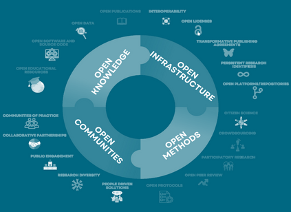

@def title = "Intro to Open"
@def tags = ["syntax", "code"]

# Introduction to the Open Research Book!!!

\tableofcontents <!-- you can use \toc as well -->

## Background

The initial contents of this web page are 15 scripts for videos that were produced at Oxford Brookes to introduce basic topics in Open Research.
We followed an outline shared in image we first encountered care of Anton Muszanskyj.  (If you know where it came from please let us know.)

@@row
@@container
@@left  @@
@@
We followed the high-level outline breaking the sections down into **open**
~~~
<a href="/Infrastructure/1.1 Open Licensing/">Infrastructure</a>, <a href="/Methods/2.1 Citizen Science and Crowdsourcing/">Methods</a>, <a href="/Communities/3.2 Research Diversity/">Communities</a>, and <a href="/Knowledge/4.1 Open Educational Resources/">Knowledge</a>.  In some cases we combined some of the topics into one script, but in general we followed the lower-level outline as well.  The hope is that this can be used as a starting point for further improvements.
~~~
~~~

~~~
@@

## Quick tour

Have a look around via the menu at left.  You’ll notice that most of the talks include some Oxford Brookes specific pointers towards the end.  These are flagged in a box as “⚠ Practice Example”.  Other related practices may be in place at other institutions.

Last modified: {{ fill fd_mtime }}.

